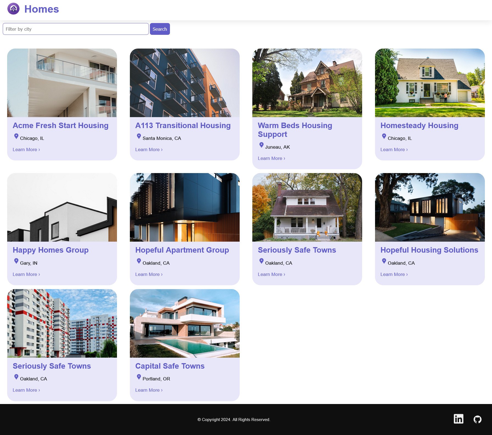
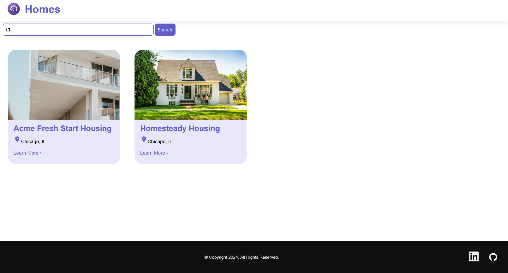
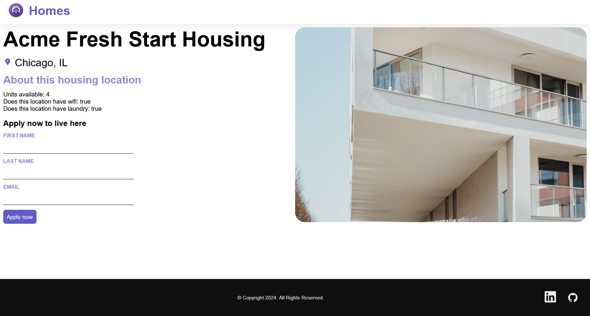
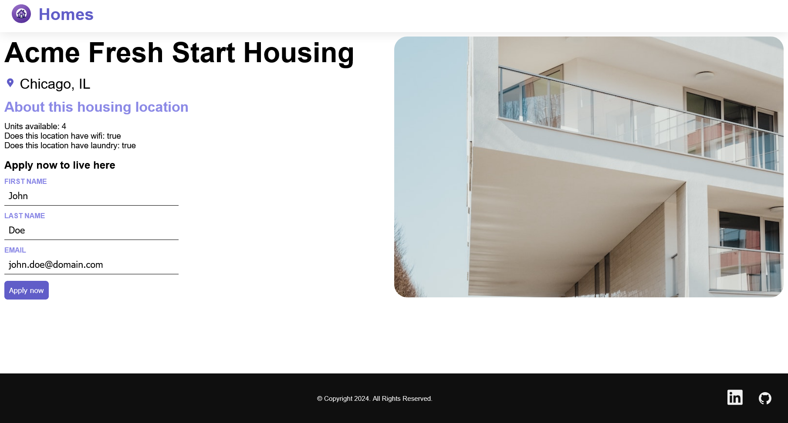

	
	<h1>Homes</h1>

Welcome to the **Homes** App!

This is an Angular application designed to demonstrate some key Angular concepts. Built using the Angular tutorial documentation.

It allows users to view homes available for rent. It uses a local json server as a database to access the application data.

## Features

- **Navigation**:
	- Defines routes to the Homes page and the Details page.
- **Homes**: 
	- Shows a list of the available Homes. Clicking on one of these will open the Details page for that Home.
	- A Search tool allows the user to type an input filter and a list of matches will be returned. Clicking on one of these will open the Details page for that Home.
- **Details**:
	- Shows the details a Home. Allows the user to apply to live in the Home by submiting a form.
- **Responsive Design**: 
	- A user-friendly interface designed to work on various devices.

## Technologies

- Angular
- HTML
- CSS

## Getting Started

### Prerequisites

- Angular v18.
- A code editor like Visual Studio or Visual Studio Code.
- Node.js
- NPM

### Installation

1. Clone the repository:
	- `git clone https://github.com/chrisjamiecarter/homes.git`

2. Navigate to the Web project directory:
	- `cd src\homes.web`

3. Install dependencies:
    - `npm install -g json-server`
	- `npm install`

### Running the Application

1. Start the json server in the Data project directory:
    - `cd src\homes.data`
	- `json-server --watch db.json`

2. Start the development server in the Web project directory:
    - `cd src\homes.web`
	- `npm start`

## Usage

Once the Web application is running:

- View the list of Homes.
- Search for a Home.
- View the Home Details.
- Apply to live in the Home.

### Home

### Search

### Details

### Apply

## How It Works

- **Page Display**: This project was generated with [Angular CLI](https://github.com/angular/angular-cli) version 18.2.6.
- **API Integration**: Uses fetch for API functions.
- **Data Storage**: Uses [json-server](https://www.npmjs.com/package/json-server) for data access and persistence.

## Contributing

Contributions are welcome! Please fork the repository and create a pull request with your changes. For major changes, please open an issue first to discuss what you would like to change.

## License

This project is licensed under the MIT License. See the [LICENSE](./LICENSE) file for details.

## Contact

For any questions or feedback, please open an issue.

---
***Happy Homesing!***
